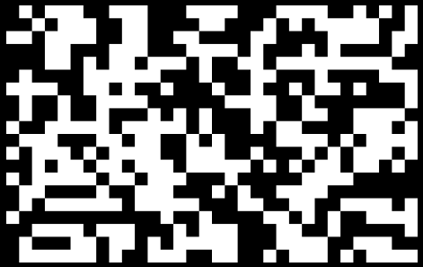

# Game of Life

## December 2022

### Google Lighthouse Score

### Description

The Game of Life, also known simply as Life, is a cellular automaton devised by the British mathematician John Horton Conway in 1970. It is a zero-player game, meaning that its evolution is determined by its initial state, requiring no further input. One interacts with the Game of Life by creating an initial configuration and observing how it evolves. It is Turing complete and can simulate a universal constructor or any other Turing machine.
[Wikipedia](https://en.wikipedia.org/wiki/Conway%27s_Game_of_Life)
