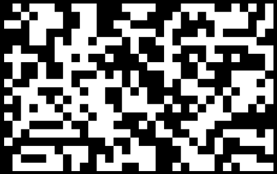

# Game of Life 

An interactive, dependency-free implementation of Conway's Game of Life in
the browser.

## Motivation

The project turns the classic cellular automaton into a compact visual
experiment: draw a starting pattern, step back, and watch simple local rules
produce complex behavior.

## Usage

Open `index.html` in a browser, or serve the repository with any static file
server. Use the canvas to draw living cells, then start, stop, clear, or
randomize the simulation.

## Preview

